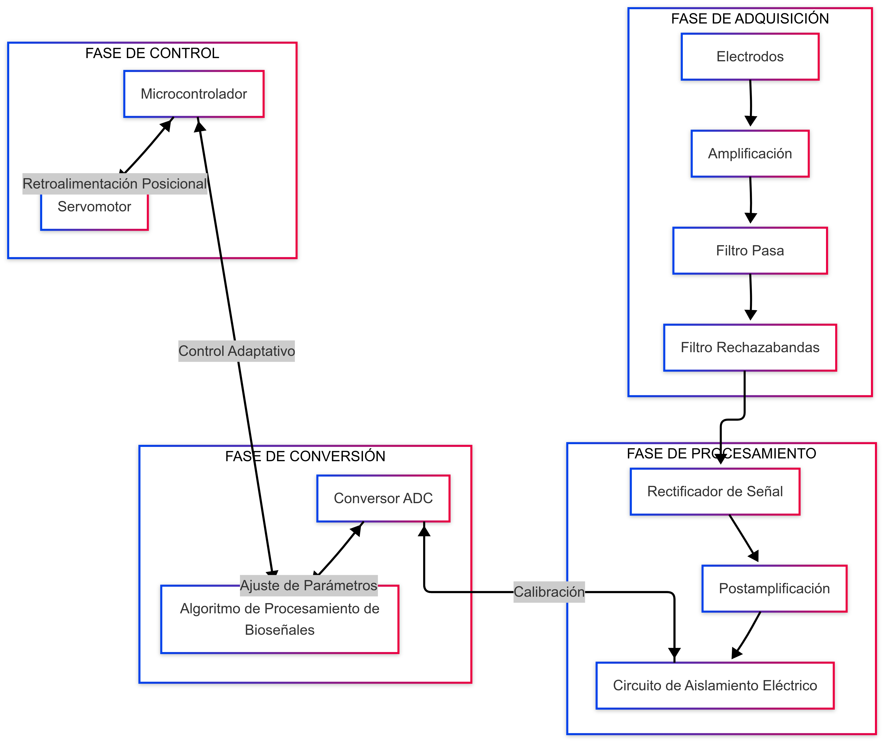
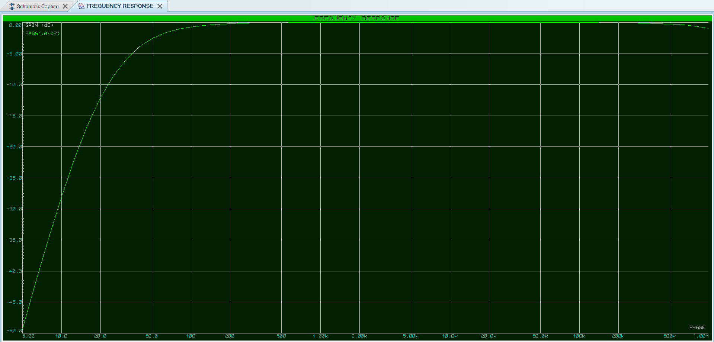
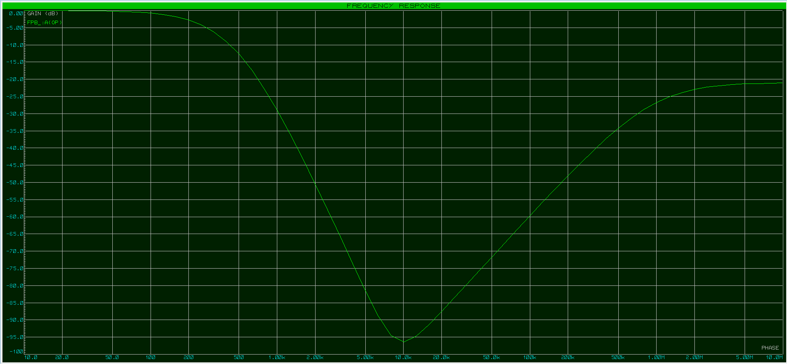
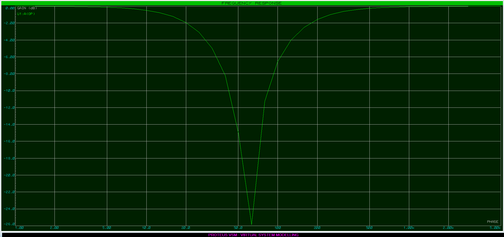
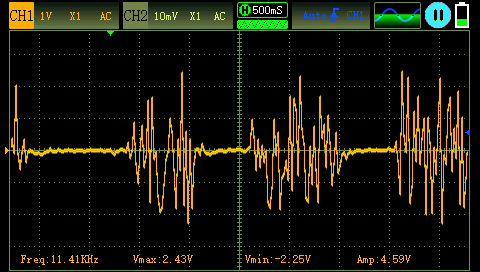
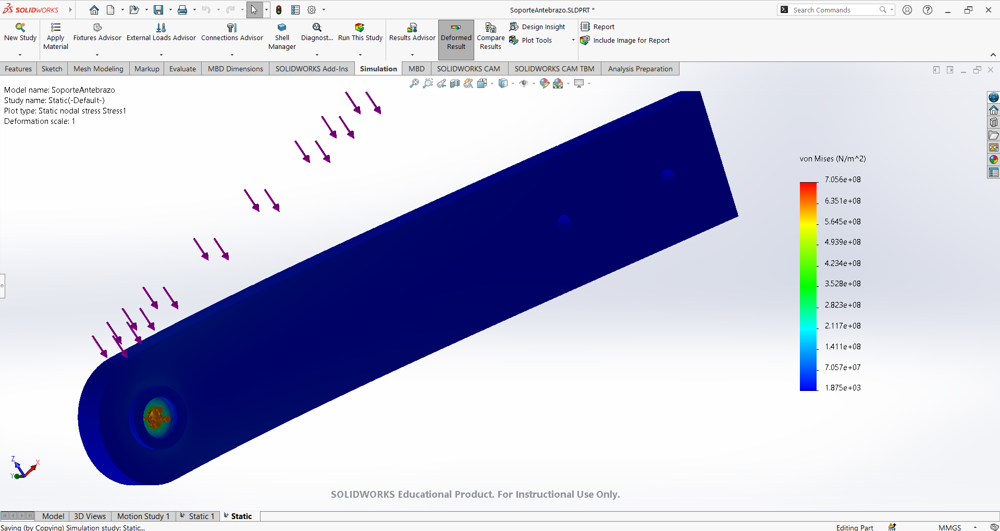
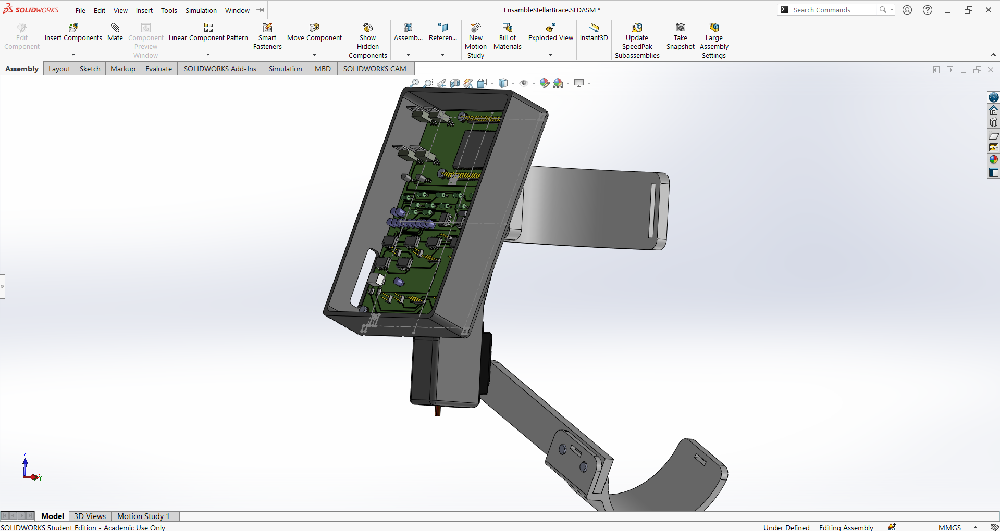

# Stellar Brace: Órtesis Robótica para Asistencia del Codo

## Descripción del Proyecto

Stellar Brace es una órtesis robótica diseñada para mejorar la calidad de vida de pacientes con disfunción motora en la articulación del codo. Este proyecto multidisciplinario integra tecnologías de bioinstrumentación, procesamiento de señales EMG, manufactura aditiva y sistemas de control para ofrecer una solución innovadora en terapia de rehabilitación y asistencia motora.

## Características Principales
- Asistencia activa: Control basado en señales EMG para movimientos de flexión y extensión del codo.
- Diseño ergonómico: Fabricado con materiales ligeros (PLA) y adaptable a diferentes usuarios.
- Procesamiento en tiempo real: Filtrado analógico y digital de señales con respuesta en <100 ms.

## Desarrolladores:
- JMVL (Ing. Biomédica)
- ALC (Ing. en Robótica)
- AMSL (Ing. Biomédica)
- JYV (Ing. Mecatrónica)

*Tecnológico de Monterrey, Campus Ciudad de México - Biohack 2025*

## Funcionamiento

*Figura 1. Diagrama de Bloques del Funcionamiento*

*Figura 2. Diagrama de Bode FPA*

*Figura 3. Diagrama de Bode FPB*

*Figura 4. Diagrama de Bode Notch*

*Figura 5. Señal EMG Adquirida*

*Figura 6. Análisis de Estatica de Soporte del Antebrazo*

*Figura 7. Ensamble Final de la Órtesis Robótica en SolidWorks*

## 📜 Licencia
Este proyecto está bajo la licencia [MIT](LICENSE).  
